<center><h1>IDEA下载与安装</h1></center>

<center><h5>作者：汐小旅Shiorys</h5></center>


> 版本说明：本文版本为 IDEA 2024.1
>


### 下载 ToolBox

JetBrains Toolbox App工具，能帮助我们轻松的管理所有JetBrains开发工具

下载地址：[JetBrains ToolBox](https://www.jetbrains.com/zh-cn/toolbox-app/)

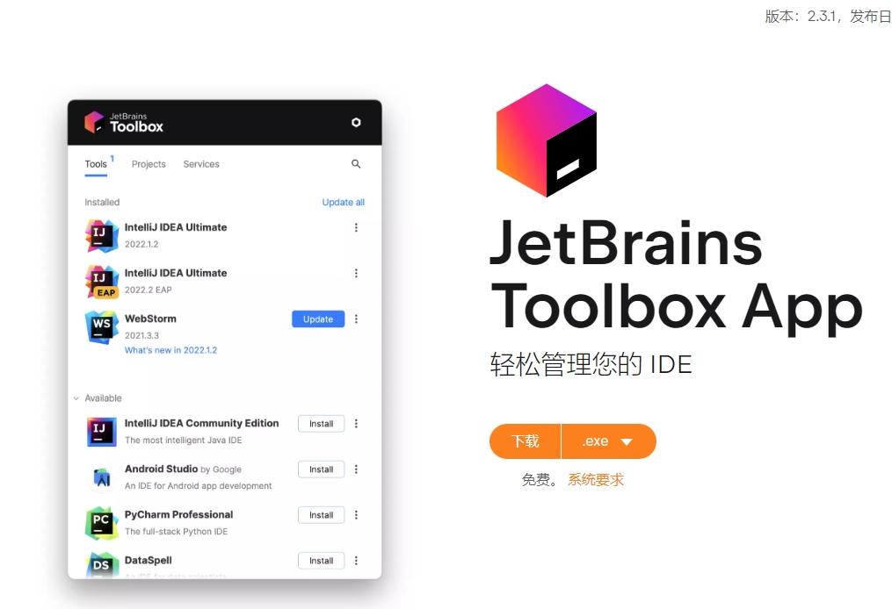

Toolbox工具下载安装完成后，接着安装所需要的开发工具，这里以 IDEA 为例


### IDEA下载与安装

可使用Toolbox下载安装（**需要先设置安装位置**），也可到官网单独下载安装：[IDEA下载](https://www.jetbrains.com.cn/idea/download/?section=windows)

Toolbox下载安装设置安装位置：

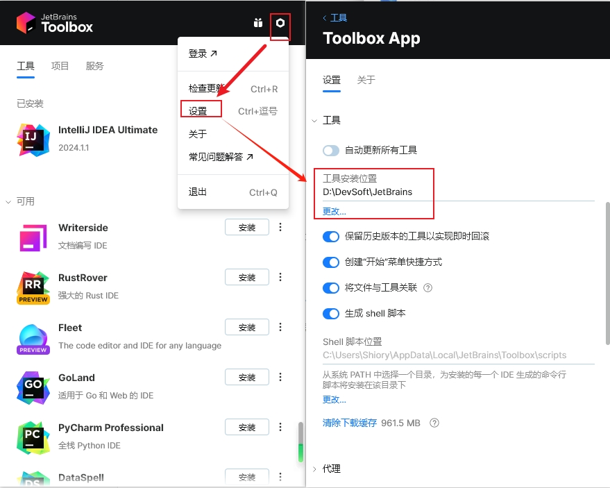

1、打开Toolbox，点击 IDEA 右边的三点，点击【可用版本】

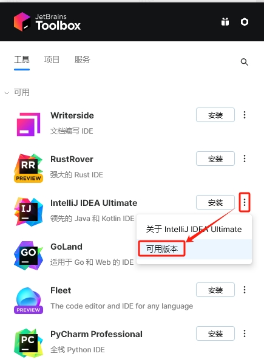


2、选择一个版本进行安装

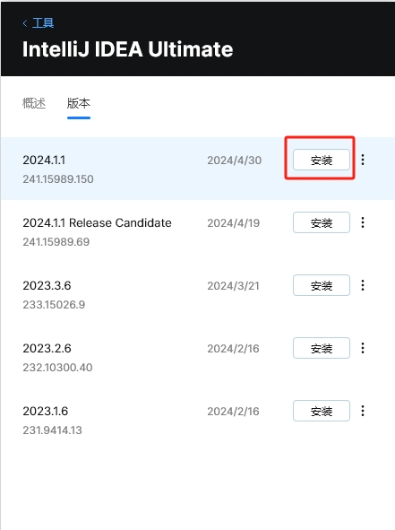


### IDEA注册

1、下载激活包，下载地址：

**Gitee**：[ja-netfilter](https://gitee.com/ja-netfilter/ja-netfilter/releases/tag/2022.2.0)

**阿里云盘**：[阿里云盘](https://www.aliyundrive.com/s/xdmwtnZ3Thk)，提取码: 03gv

**详细教程**：[阿里云盘](https://www.alipan.com/s/sn4svWfGXmQ)，提取码: 61kh

下载**ja-netfilter**压缩包进行解压缩，然后放在本地磁盘文件夹中，注意路径不要有中文，激活包内文件无需修改，只要把**ja-netfilter.jar**的路径复制下来即可，后续会用到

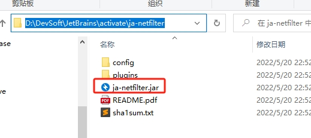


2、打开Toolbox，点击DIEA右边的三点，点击【设置】

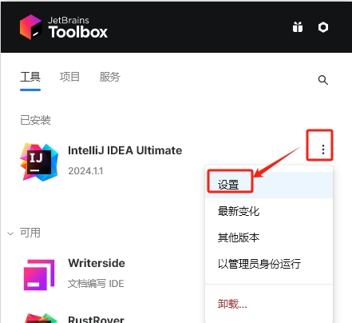


3、点击《配置》，再点击《编辑 JVM 选项》

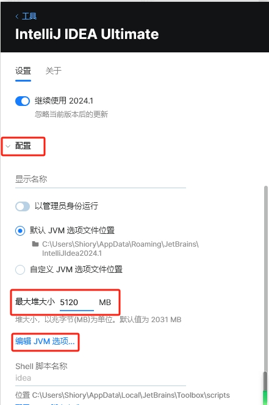


4、复制下面代码到 JVM 配置中

```bash
--add-opens=java.base/jdk.internal.org.objectweb.asm=ALL-UNNAMED
--add-opens=java.base/jdk.internal.org.objectweb.asm.tree=ALL-UNNAMED
# 下面javaagent配置的是 ja-netfilter.jar 路径地址
-javaagent:D:\DevSoft\JetBrains\activate\ja-netfilter\ja-netfilter.jar
```

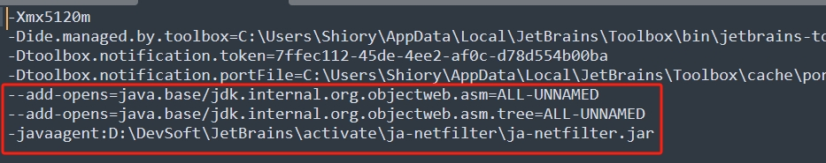


5、以上步骤完成后，打开 IDEA，，如果之前有安装，就导入之前安装的配置文件，没有就选择不导入。点击OK

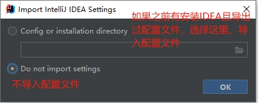


6、如果还是需要激活，如图

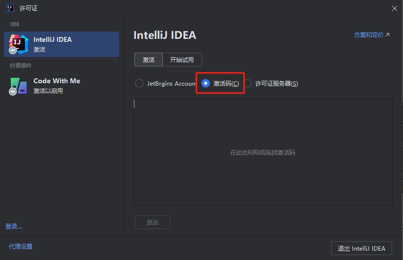

那就到网站：https://3.jetbra.in/ 网站上找一个可用的服务器地址进入

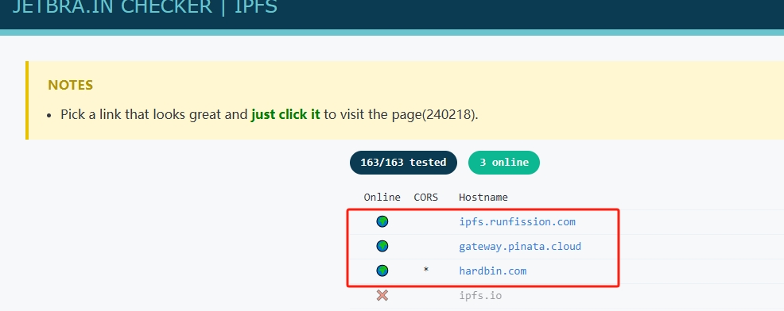

如：[hardbin.com](https://hardbin.com/ipfs/bafybeiawsvnhqx5o2aqa37pvq7brlk7vqj2cpty3b5xac655bxbpqbpkq4/)，重新下载对应的压缩包，替换掉之前的**ja-netfilter**压缩包内的内容


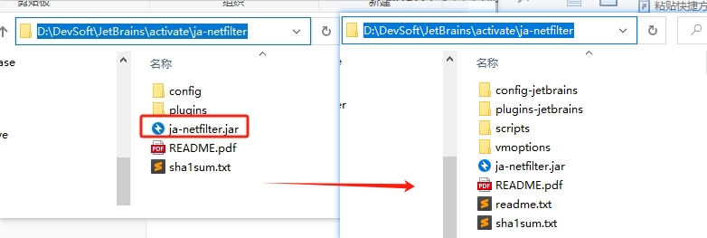

同时JVM 配置变更如下：多了一个`=jetbrains`

```bash
--add-opens=java.base/jdk.internal.org.objectweb.asm=ALL-UNNAMED
--add-opens=java.base/jdk.internal.org.objectweb.asm.tree=ALL-UNNAMED
# 下面javaagent配置的是 ja-netfilter.jar 路径地址
-javaagent:D:\DevSoft\JetBrains\activate\ja-netfilter\ja-netfilter.jar=jetbrains
```

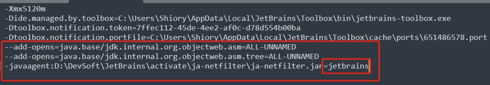

然后在重新打开IDEA，再到上述新下载jar包的网站上复制激活码到 IDEA 中，点击《激活》

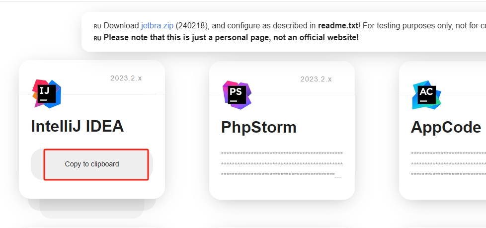

激活码：

```bash
29VRVXKXEQ-eyJsaWNlbnNlSWQiOiIyOVZSVlhLWEVRIiwibGljZW5zZWVOYW1lIjoiZ3VyZ2xlcyB0dW1ibGVzIiwiYXNzaWduZWVOYW1lIjoiIiwiYXNzaWduZWVFbWFpbCI6IiIsImxpY2Vuc2VSZXN0cmljdGlvbiI6IiIsImNoZWNrQ29uY3VycmVudFVzZSI6ZmFsc2UsInByb2R1Y3RzIjpbeyJjb2RlIjoiSUkiLCJmYWxsYmFja0RhdGUiOiIyMDI2LTA5LTE0IiwicGFpZFVwVG8iOiIyMDI2LTA5LTE0IiwiZXh0ZW5kZWQiOmZhbHNlfSx7ImNvZGUiOiJQQ1dNUCIsImZhbGxiYWNrRGF0ZSI6IjIwMjYtMDktMTQiLCJwYWlkVXBUbyI6IjIwMjYtMDktMTQiLCJleHRlbmRlZCI6dHJ1ZX0seyJjb2RlIjoiUFNJIiwiZmFsbGJhY2tEYXRlIjoiMjAyNi0wOS0xNCIsInBhaWRVcFRvIjoiMjAyNi0wOS0xNCIsImV4dGVuZGVkIjp0cnVlfSx7ImNvZGUiOiJQREIiLCJmYWxsYmFja0RhdGUiOiIyMDI2LTA5LTE0IiwicGFpZFVwVG8iOiIyMDI2LTA5LTE0IiwiZXh0ZW5kZWQiOnRydWV9XSwibWV0YWRhdGEiOiIwMTIwMjMwOTE0UFNBWDAwMDAwNSIsImhhc2giOiJUUklBTDoxNjQ5MDU4NzE5IiwiZ3JhY2VQZXJpb2REYXlzIjo3LCJhdXRvUHJvbG9uZ2F0ZWQiOmZhbHNlLCJpc0F1dG9Qcm9sb25nYXRlZCI6ZmFsc2V9-YKRuMTrLQcfyWisYF1q6RhCN+Ub13VOCayGGc6tklGA97oxRM1HCIR0oI5yfTjL7UQYDbNMokT0U0ZQ2obYaUx+MMf7+3FfUYp5dYzP7G9YrEehrGWQ4O8ENrDLDAClB8o8jud9cafW9WTx9hDNd9j2FfjwSaRibClwGBRdO5fSkWlKGhx4tV0K9IyotNYDQzT1QCDRWSxHYGqfDAQI2k+ZAqzNEHValupSM3TKw813kFGKIQndMfw57B6uMzgN6PvuuLpBlghdO3imrgKYj0Q59JYbuXRUpHhPnNLY1XmewdlfcJkvTiRwueCPMNEW/CQEh8X/Als92WCr2H3uFRA==-MIIETDCCAjSgAwIBAgIBDTANBgkqhkiG9w0BAQsFADAYMRYwFAYDVQQDDA1KZXRQcm9maWxlIENBMB4XDTIwMTAxOTA5MDU1M1oXDTIyMTAyMTA5MDU1M1owHzEdMBsGA1UEAwwUcHJvZDJ5LWZyb20tMjAyMDEwMTkwggEiMA0GCSqGSIb3DQEBAQUAA4IBDwAwggEKAoIBAQCUlaUFc1wf+CfY9wzFWEL2euKQ5nswqb57V8QZG7d7RoR6rwYUIXseTOAFq210oMEe++LCjzKDuqwDfsyhgDNTgZBPAaC4vUU2oy+XR+Fq8nBixWIsH668HeOnRK6RRhsr0rJzRB95aZ3EAPzBuQ2qPaNGm17pAX0Rd6MPRgjp75IWwI9eA6aMEdPQEVN7uyOtM5zSsjoj79Lbu1fjShOnQZuJcsV8tqnayeFkNzv2LTOlofU/Tbx502Ro073gGjoeRzNvrynAP03pL486P3KCAyiNPhDs2z8/COMrxRlZW5mfzo0xsK0dQGNH3UoG/9RVwHG4eS8LFpMTR9oetHZBAgMBAAGjgZkwgZYwCQYDVR0TBAIwADAdBgNVHQ4EFgQUJNoRIpb1hUHAk0foMSNM9MCEAv8wSAYDVR0jBEEwP4AUo562SGdCEjZBvW3gubSgUouX8bOhHKQaMBgxFjAUBgNVBAMMDUpldFByb2ZpbGUgQ0GCCQDSbLGDsoN54TATBgNVHSUEDDAKBggrBgEFBQcDATALBgNVHQ8EBAMCBaAwDQYJKoZIhvcNAQELBQADggIBABKaDfYJk51mtYwUFK8xqhiZaYPd30TlmCmSAaGJ0eBpvkVeqA2jGYhAQRqFiAlFC63JKvWvRZO1iRuWCEfUMkdqQ9VQPXziE/BlsOIgrL6RlJfuFcEZ8TK3syIfIGQZNCxYhLLUuet2HE6LJYPQ5c0jH4kDooRpcVZ4rBxNwddpctUO2te9UU5/FjhioZQsPvd92qOTsV+8Cyl2fvNhNKD1Uu9ff5AkVIQn4JU23ozdB/R5oUlebwaTE6WZNBs+TA/qPj+5/we9NH71WRB0hqUoLI2AKKyiPw++FtN4Su1vsdDlrAzDj9ILjpjJKA1ImuVcG329/WTYIKysZ1CWK3zATg9BeCUPAV1pQy8ToXOq+RSYen6winZ2OO93eyHv2Iw5kbn1dqfBw1BuTE29V2FJKicJSu8iEOpfoafwJISXmz1wnnWL3V/0NxTulfWsXugOoLfv0ZIBP1xH9kmf22jjQ2JiHhQZP7ZDsreRrOeIQ/c4yR8IQvMLfC0WKQqrHu5ZzXTH4NO3CwGWSlTY74kE91zXB5mwWAx1jig+UXYc2w4RkVhy0//lOmVya/PEepuuTTI4+UJwC7qbVlh5zfhj8oTNUXgN0AOc+Q0/WFPl1aw5VV/VrO8FCoB15lFVlpKaQ1Yh+DVU8ke+rt9Th0BCHXe0uZOEmH0nOnH/0onD
```

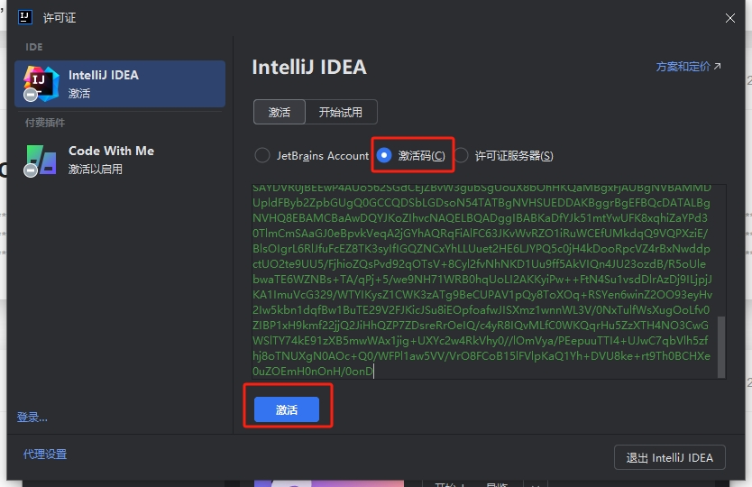

可以看到 IDEA 已经激活，有效期至2026年9月14日，但是无需在意时间，实为永久激活

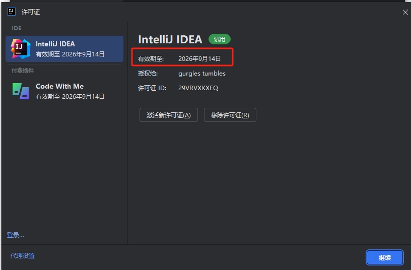
