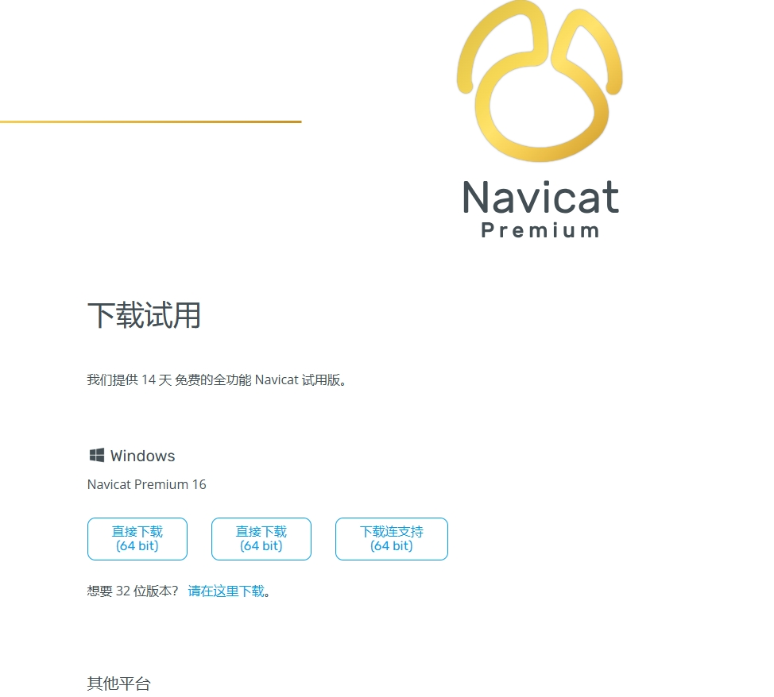
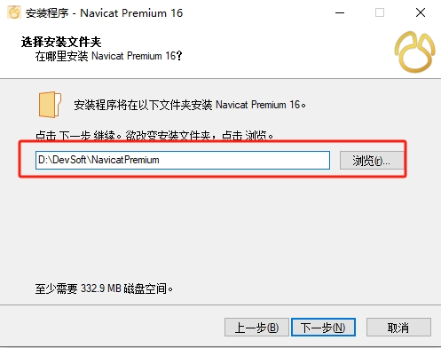
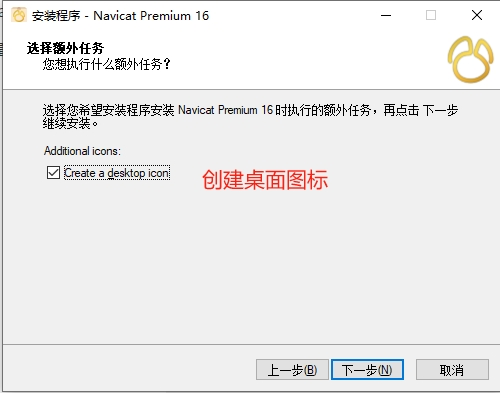
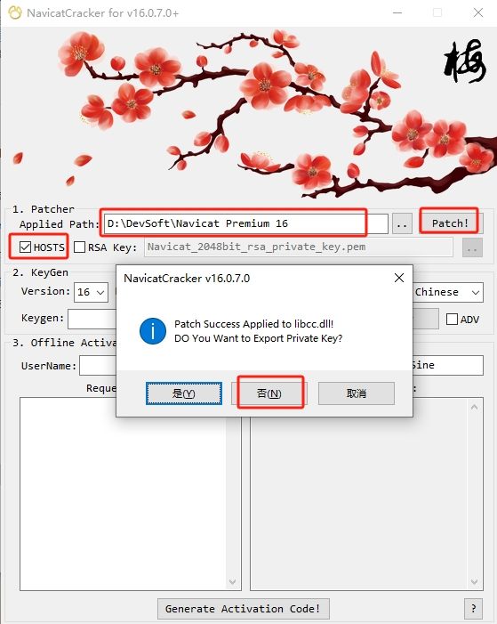
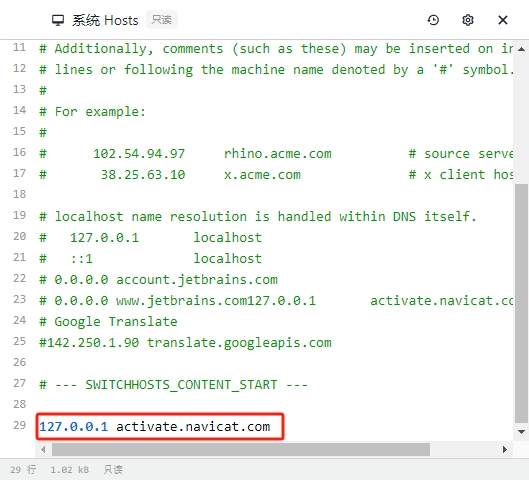
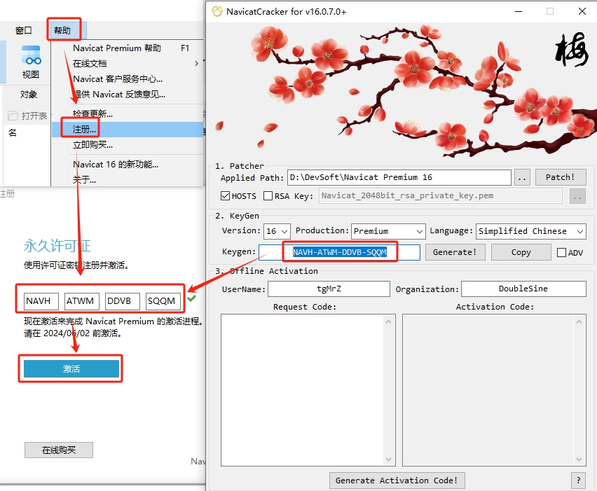
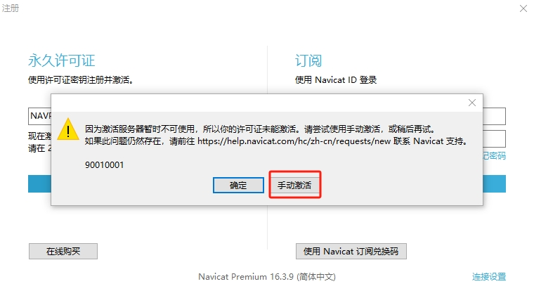
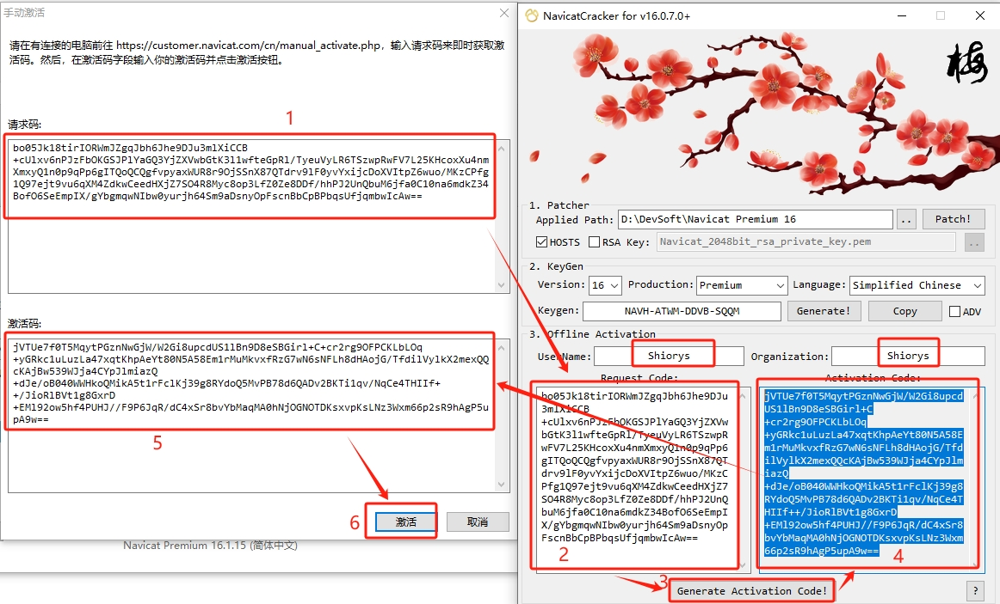
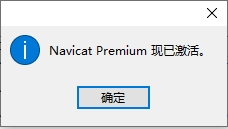
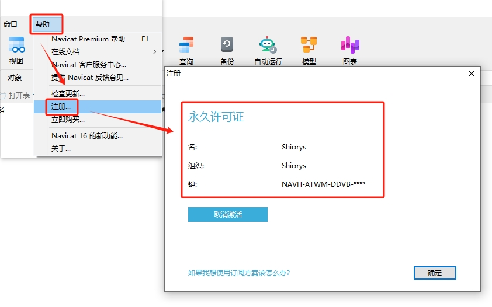

<center><h1>NavicatPremium下载与安装</h1></center>

<center><h5>作者：汐小旅Shiorys</h5></center>


> 版本说明：本文版本为 NavicatPremium 16.1
>
> 历史版本下载：
>
> ```
> 链接的格式 ： 前缀+版本+类型+语言+位数
> 前缀：http:/download.navicat.com/download/navicat
> 类型：premium代表豪华版，其他如mysql等
> 版本：三位数，前两位是大版本，后一位是小版本，如163代表16.3版本
> 语言：cs代表简体中文，en代表英文
> 位数：x86代表32位，x64代表64位，一般下载64位即可
> 
> 如16.3 64位 英文
> http://download.navicat.com/download/navicat163_premium_en_x64.exe
> 如16.3 64位 中文
> http://download.navicat.com/download/navicat163_premium_cs_x64.exe
> ```


### NavicatPremium下载

下载地址：[NavicatPremium](https://www.navicat.com.cn/download/navicat-premium)，根据自己的系统下载对应的版本




### NavicatPremium安装

注意：如果你本机已经装了 `Navicat`，**强烈建议**先使用 **[Geek](https://geekuninstaller.com/download)**进行完全卸载再重新安装 **(PS:记得先导出数据库的链接，重新安装完成后再导入即可)**

**特别注意**：Navicat 安装路径不要有中文，也不要有空格

安装Navicat，设置Navicat的安装路径即可，选择创建桌面快捷方式。一路下一步即可安装成功





### NavicatPremium注册

注册机下载地址：

1. **阿里云盘**： [navicat16v注册机 ](https://www.aliyundrive.com/s/mEevP18FJGA)提取码: 6a8j
2. **百度云盘**： [navicat16v注册机](https://pan.baidu.com/s/1SimGkIYnrRfPb1EF-hsBaA?pwd=d4r2)
3. **GitHub**：[navicat-keygen-16V](https://github.com/LiJunYi2/navicat-keygen-16V/releases)

注意：

1. 成功安装 `Navicat Premium 16` 后，先不要运行Navicat
2. 注册机 **断网有网** 都可以激活，最主要的是第一步 `勾选 HOSTS` , 然后点击 `Patch` 按钮！第一步操作之后，查看自己系统的 `HOSTS` 文件有没有成功添加 `127.0.0.1 activate.navicat.com`


1、建议先关闭杀毒软件，双击打开注册机.

`Path` 显示的目录为 `Navicat16` 的安装目录，默认显示为 `C:\Program Files\PremiumSoft\Navicat Premium 16` ，根据自己的安装情况选择到你的 `Navicat16` 的安装目录，界面如图

2、勾选 `HOSTS` , 然后点击 `Patch!` 按钮，注意：不要勾选 `RSA KEY`

```txt
勾选HOSTS会修改 hosts 文件，添加 127.0.0.1 activate.navicat.com 达到屏蔽 Navicat16 激活联网
如果没有添加成功，建议断开网络，或请自行前往 C:\Windows\System32\drivers\etc 手动在 HOSTS 文件中添加
```






3、默认情况下，`Version` 选择 `v16`， `Production` 选择 `Premium`， `Language` 选择 `Simplified Chinese`， 点击 `Generate!` 按钮，生成序列号


4、打开 `Navicat Premium 16` ()，选择《帮助》---《注册》，然后把注册机生成的序列号填写到 `Navicat` 中，点击《**激活**》，会弹出选择激活方式的窗口（如果没弹出激活方式窗口，就重新重复3步骤，获取另一个注册码）。一般来说在线激活肯定会失败，所以直接选择 《**手动激活**》

> 如果勾选了 `HOSTS` ，且 `HOSTS` 被修改成功了，会直接打开 `Navicat`。否则需要手动打开Navicat






5、在 《**手动激活**》 窗口会得到一个请求码，复制它并把它粘贴到注册机里的《 **Request Code**》 里，《**UserName**》 和《 **Organization**》 可以自定义

然后点击 注册机的 《**Generate Activtion Code!**》 按钮，生成《 **Activtion Code**》，把《 **Activtion Code**》中内容 粘贴到 《Navicat 的 **激活码**》 输入框中，点击《 **激活**》 即可大功告成






