<center><h1>VMware Workstation Pro下载与安装</h1></center>

<center><h5>作者：汐小旅Shiorys</h5></center>


> 版本说明：本文版本为 VMware Workstation Pro 17


### Workstation Pro下载

下载地址：[workstation-pro](https://www.vmware.com/products/workstation-pro/workstation-pro-evaluation.html)，根据自己的系统下载对应的版本

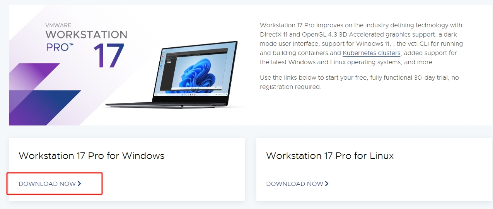


### Workstation Pro安装

1、双击运行下载的exe文件，基本就是根据提示点击**下一步**

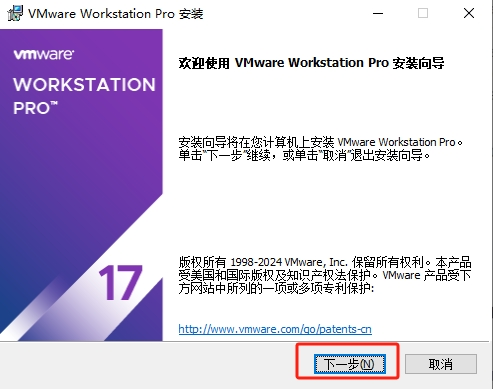


2、接受《许可协议》，然后点击下一步

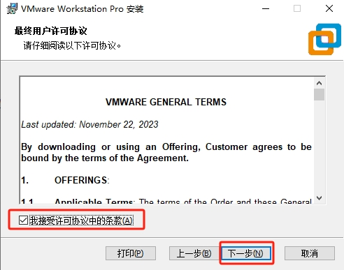


3、选择《安装位置》，下面那个《增强型键盘驱动程序》，只能在Windows系统使用，可以根据自己需要选择，建议勾选，因为是一些增强组件功能，勾选上以后安装完成会提示重启电脑，没勾选就不会提示重启

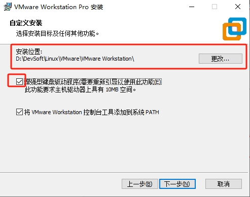


4、用户体验设置页面，取消《启动时检查产品更新》和《加入VMware客户体验提升计划》两项的勾选，避免升级收费，点击**下一步**

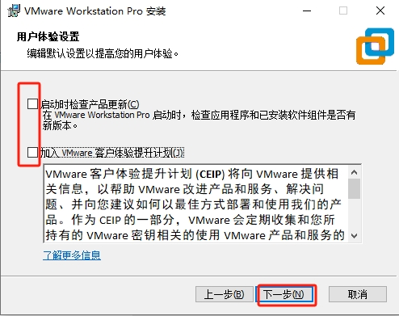


5、选择是否创建快捷方式，根据需要勾选，可以单独选择《桌面》方式，点击**下一步**

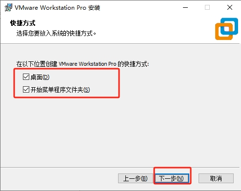


6、点击**安装**则开始进行安装

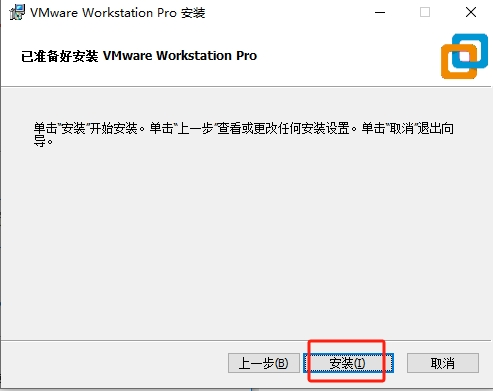


7、安装完成后，点击**完成**，然后暂不重启

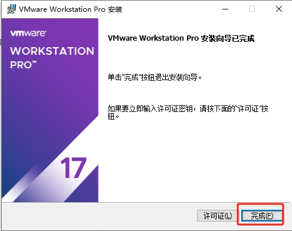

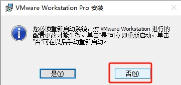


### Workstation Pro注册

1、双击打开Workstation Pro，输入或复制粘贴许可证秘钥，然后点击**继续**

以下提供几个可使用的许可证秘钥，也可以**自行百度**或者下载注册机获取

```txt
VMware Workstation Pro 17 许可证秘钥
MC60H-DWHD5-H80U9-6V85M-8280D
4A4RR-813DK-M81A9-4U35H-06KND
NZ4RR-FTK5H-H81C1-Q30QH-1V2LA
JU090-6039P-08409-8J0QH-2YR7F
4Y09U-AJK97-089Z0-A3054-83KLA
4C21U-2KK9Q-M8130-4V2QH-CF810

VMware Workstation Pro 16 许可证秘钥
ZF3R0-FHED2-M80TY-8QYGC-NPKYF
YF390-0HF8P-M81RQ-2DXQE-M2UT6
ZF71R-DMX85-08DQY-8YMNC-PPHV8
```

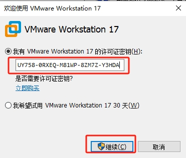


2、如果许可证秘钥有效，则出现下面的界面。如果无效，则可继续**自行百度或者下载注册机**获取

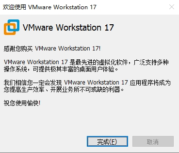


3、注册成功后，进入软件，查看有效期：《帮助》--- 《关于VMware Workstation》

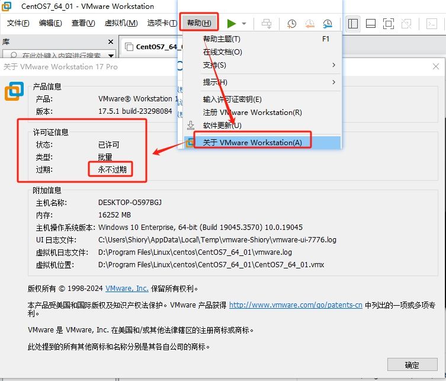


### Workstation Pro设置

主要是设置《工作区》的《虚拟机默认位置》

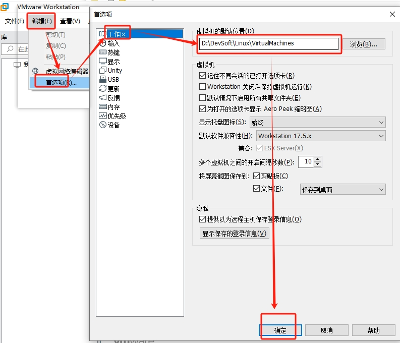


### Workstation Pro扩展知识

安装完Workstation Pro后，网络中适配器中会多出VMware相关的两个网络适配器，代表安装完成，如果没有多出来两个相关的网络适配器表示安装失败。（VMware安装完成后，因为虚拟机也要联网，所以会多出两个网络适配器，**VMnet1**是**仅主机模式**或**桥接模式**的网络适配器，**VMnet8**是**NAT模式**的网络适配器，可在《编辑》---《虚拟网络编辑器》中查看到）


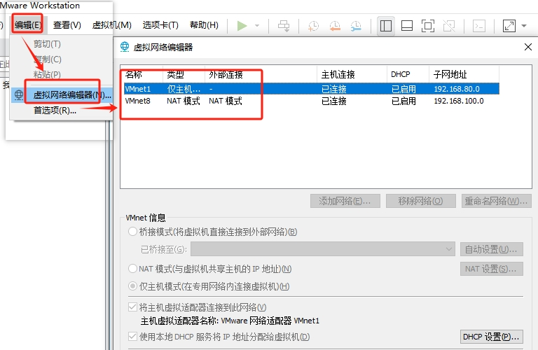
