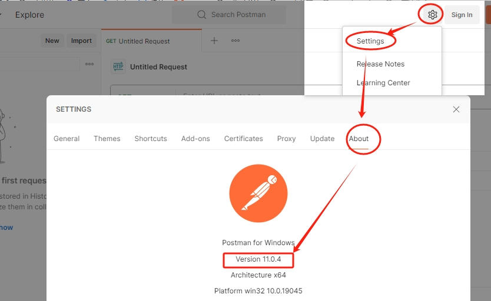
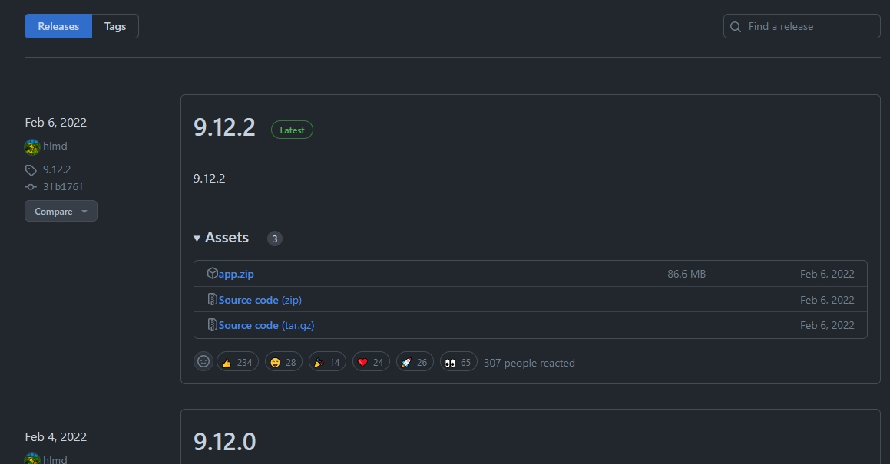
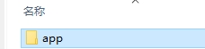
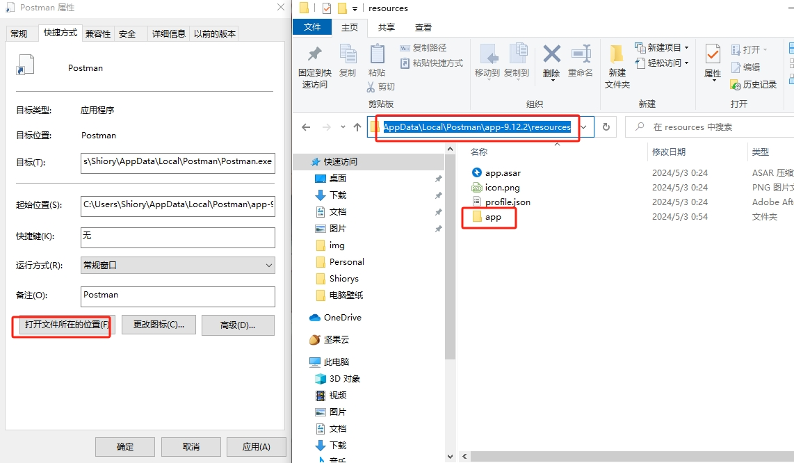
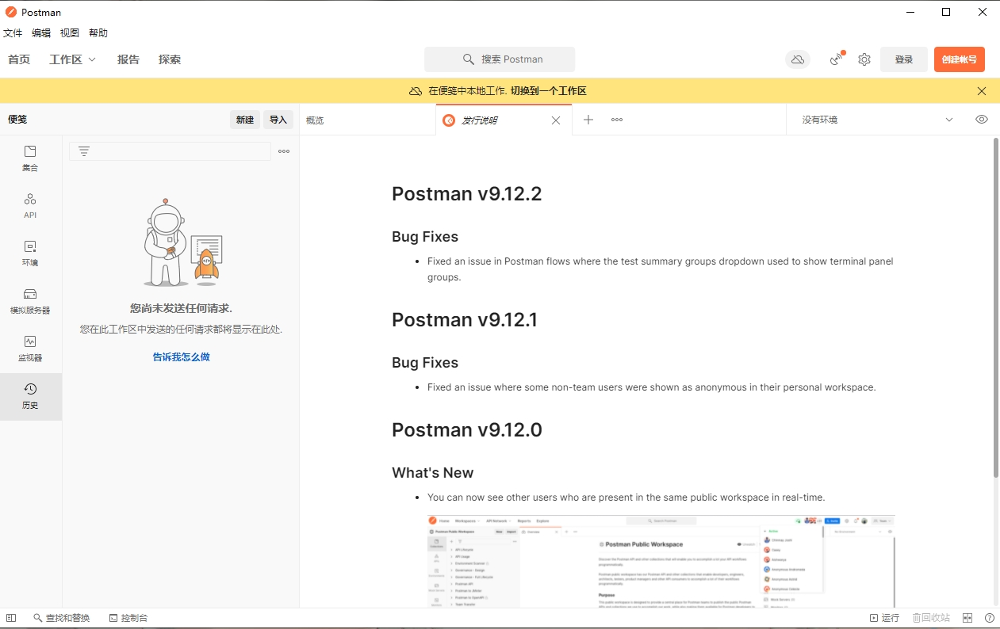
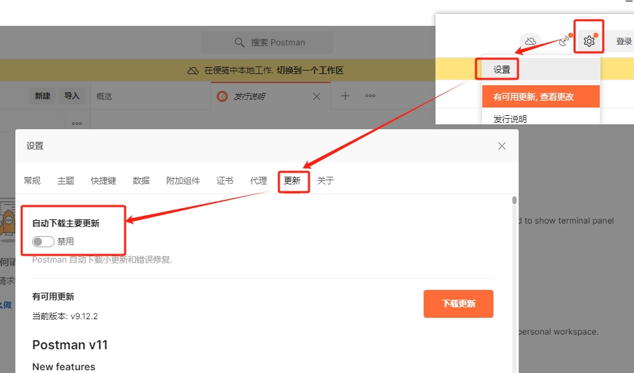
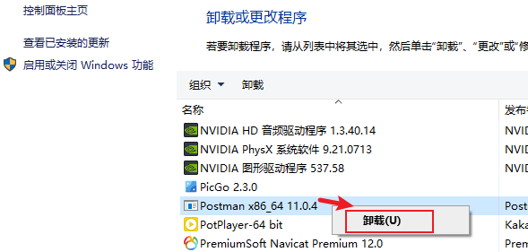
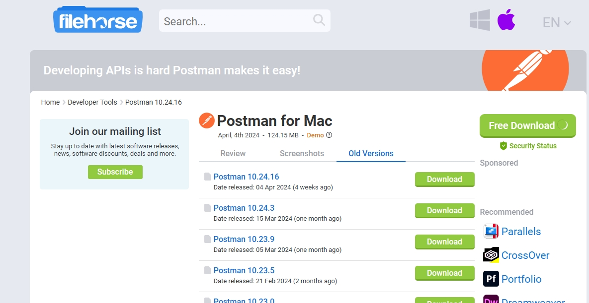
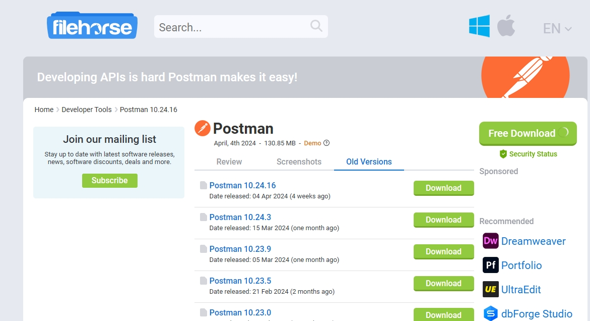

<h1>Postman汉化教程</h1>

<h5>作者：汐小旅Shiorys</h5>

### 下载Postman

官网地址：[Postman](https://web.postman.com/)；[Postman(需魔法)](https://www.postman.com/)，根据自己的系统下载安装即可

**注**：postman无法自定义安装路径，默认安装在C盘。默认英文版

### Postman汉化

1、查看下载安装的Postman的版本

2、汉化包地址：[Postman-cn](https://github.com/hlmd/Postman-cn/releases)，根据自己的Postman版本下载对应版本的汉化包。由于本文中的Postman版本过高，所以需要下载旧版Postman，见下文《**Postman下载历史版本**》

3、解压下载的汉化包，会得到一个**app**文件夹

4、打开Postman安装路径，将**app**文件夹拷贝到postman安装目录下【Postman\app-9.12.2\resources】

5、重启postman，看到是中文版

6、注意事项：汉化包只针对单个版本，一旦更新则汉化会失效，所以需要设置关闭【自动更新】

### Postman下载历史版本

1、在安装的 Postman旧版本时，为了避免出现意外的冲突，需要先把系统本地的 Postman 删除了。如果电脑是 Windows，那么可以在控制面板中将现有的 Postman 版本删除。

2、下载所需的历史版本，目前只有 macOS 系统和 Windows 系统的历史版本，选择一个版本，点击【**Download**】下载即可

macOS 系统：[MacOS系统](https://mac.filehorse.com/download-postman/old-versions/)

Windows 系统：[Windows 系统](https://www.filehorse.com/download-postman/old-versions/)

